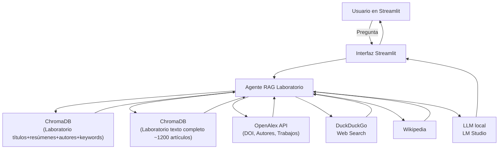
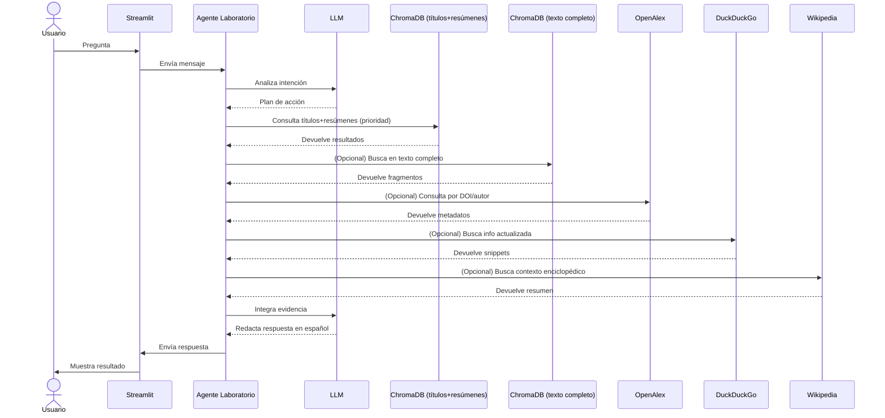

# RAG_ICN: Agente RAG del Laboratorio de Dinámica no Lineal

El **RAG_ICN** es un sistema conversacional avanzado basado en agentes diseñado para explorar y consultar la producción científica del Laboratorio de Dinámica no Lineal (www.dynamics.unam.edu). Utiliza técnicas de Generación Aumentada por Recuperación (RAG) para proporcionar respuestas precisas y fundamentadas a partir de una base de datos vectorial en **ChromaDB**, donde se ha indexado la producción científica del laboratorio.

El sistema se puede acceder en las siguientes URLs:

*   **RAG del Laboratorio de Dinámica**: [https://dinamica1.fciencias.unam.mx/rag/](https://dinamica1.fciencias.unam.mx/rag/)
*   **Chatbot de la Facultad de Ciencias**: [https://dinamica1.fciencias.unam.mx/chatbot/](https://dinamica1.fciencias.unam.mx/chatbot/)


El agente integra además herramientas externas como OpenAlex, DuckDuckGo y Wikipedia para enriquecer el contexto y la actualidad de la información.

## 🚀 Instalación y Requisitos

### Requisitos Previos
- **Python 3.10+** (Se recomienda usar un entorno virtual).
- **LM Studio** ejecutándose localmente con un modelo compatible (ej. `nomic-embed-text` para embeddings y `phi-4` para chat).
- Dependencias de Python.

### Pasos de Instalación

1.  **Clonar el repositorio** (si aplica) o navegar al directorio del proyecto.
2.  **Instalar dependencias**:
    ```bash
    pip install streamlit langchain langchain-community langchain-openai langchain-chroma langgraph pyalex python-dotenv torch bs4 captcha
    ```
3.  **Configurar Variables de Entorno**:
    Crea un archivo `.env` en la raíz del proyecto (basado en el archivo `.gitignore` configurado) con el siguiente contenido:
    ```env
    OPENALEX_EMAIL=tu_correo@ejemplo.com
    LM_STUDIO_BASE_URL=http://localhost:1234/v1
    LM_STUDIO_API_KEY=lm-studio
    CHROMA_PERSIST_DIRECTORY=../
    ```

4.  **Ejecutar la aplicación**:
    ```bash
    streamlit run RAG_ICN.py
    ```

---

## 🛠️ Cómo funciona (Arquitectura RAG)

El sistema opera bajo un flujo de **Generación Aumentada por Recuperación (RAG)**, lo que significa que antes de generar una respuesta, el agente "investiga" en diversas fuentes para encontrar información relevante.

### Flujo de Trabajo del Agente

1.  **Análisis de Intención**: El LLM local (vía LM Studio) analiza la pregunta del usuario para determinar qué herramientas necesita.
2.  **Recuperación (Retrieval)**:
    *   **Prioridad 1**: Busca en la base de datos vectorial de **títulos, resúmenes, autores y keywords** de artículos del Laboratorio de Dinámica.
    *   **Prioridad 2**: Consulta fragmentos de **texto completo** de ~1200 artículos científicos vectorizados.
    *   **Herramientas Externas**: Si es necesario, consulta metadatos en **OpenAlex**, realiza búsquedas en **DuckDuckGo** o extrae contexto de **Wikipedia**.
3.  **Aumentación y Síntesis**: El agente integra toda la evidencia recuperada y la traduce (si es necesario) para redactar una respuesta final en español.

### Diagrama de Arquitectura



### Diagrama de Secuencia



---

## 📈 Pipeline de Procesamiento Paso a Paso

1.  **Entrada**: El usuario pregunta en la interfaz de Streamlit.
2.  **Razonamiento (ReAct)**: El LLM decide qué herramientas usar basándose en la especificidad de la pregunta.
3.  **Búsqueda Multimodal**: Se consultan las bases vectoriales locales y APIs externas.
4.  **Generación**: El LLM redacta la respuesta final asegurando que sea concisa y esté fundamentada en los datos recuperados.


